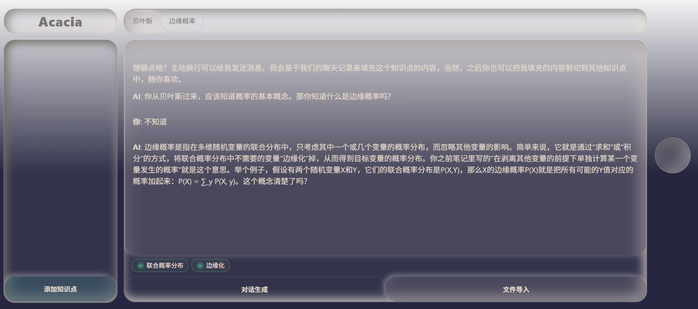

[English version](./README.md)

# Acacia

<strong>把你的知识变成一棵会生长的树</strong>

## 功能

- 🌲 **知识树可视化** - 体现你的知识风格，伴随你成长。

- 🗣️ **AI对话** — 围绕知识点深度提问引导，更轻松地收获笔记和知识点。

- 基本的知识管理功能。

## 运行

- **在线版本**：[acacia.tandyblow.top](https://acacia.tandyblow.top)
- **本地运行**：`bash dev.sh`
- **Docker**: `docker compose up`

## 风格是如何生成的？

使用大模型基于你的知识数据生成提示词，然后用 GPT-image-2 编辑基础背景。

## 未来计划

当前项目已完成一半的计划工作。
下一步：
- **ai对话功能优化**: 优化知识点和笔记的生成质量，优化对话流程。
- **操作体验优化**: 优化页面跳转逻辑和动画，加入更便捷易懂的操作方法。
- **复习功能改进**: 取消"今日成长"模块，让每个知识点具备自行生长的功能，ai随时可在某一块笔记后写入一句质疑。
- **生长系统优化**: 当前生长结构较为固定，缺乏多样性。
- **引入经营要素**: 在主页树系统中添加经营要素。

## 致谢

- [proctree.js](https://github.com/supereggbert/proctree.js) 为其卡通树叶
- [EZ-Tree](https://github.com/dgreenheck/ez-tree) 为其树结构
- [LINUX.DO](https://linux.do)
